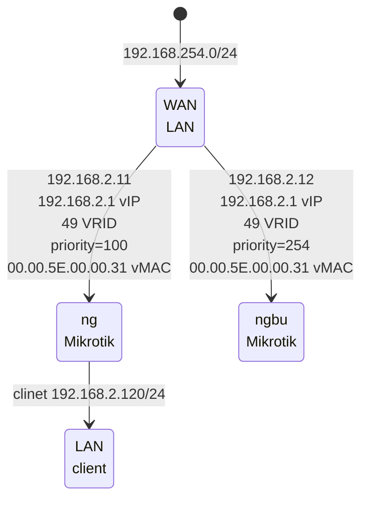

[edit](https://github.com/christrees/wip/edit/main/labnotes/README.md)

# WIP labnotes 
please clear before brain explodes
## subpages in labnotes
- [gh-build.md](./gh-build.md)
- [storage-backup-archive.md](./storage-backup-archive.md)
- [markdown-mermaid.md](./markdown-mermaid/)
- [mikrotik-test.md](./mikrotik-test/)
- [mikrotik-vrrp.md](./mikrotik-vrrp.md)


## quick notes
- document nginx proxy install
- [https://medium.com/@devops.ent/nginx-proxy-manager-how-to-installation-and-configuration-using-docker-portainer-1348c67a392e](https://medium.com/@devops.ent/nginx-proxy-manager-how-to-installation-and-configuration-using-docker-portainer-1348c67a392e)
- tbd
- verify documents in proxmox notes.. reflect in a 2cld repo ?
- get windows machine on proxmox
- zerotier to something inside wf
- remote config
- zerotier in linux container [zerotier-in-lxc-proxmox](https://forum.level1techs.com/t/zerotier-in-lxc-proxmox/155515/11)
- look at tailscale
- check firetv recast
- check gh catmedia transfers
- add drives to cg.wf.2cld.net

## cf.2cld.net (replacement)
- [Windstream - http://192.168.254.254/](http://192.168.254.254/) 
- [Windstream - http://192.168.254.254/advancedsetup_storagedeviceinfo.html](http://192.168.254.254/advancedsetup_storagedeviceinfo.html)
- [Mikrotik - https://github.com/2cld/mikrotik](https://github.com/2cld/mikrotik)
- [tbd]()
- [tbd]()
- [tbd]()

## wf.christrees.com
- [https://whatismyipaddress.com/ip/173.191.244.125](https://whatismyipaddress.com/ip/173.191.244.125)
- [https://whatismyipaddress.com/](https://whatismyipaddress.com/)

## 192.168.254.0/24 gw [http://192.168.254.254/](http://192.168.254.254/) - IPA [http://192.168.254.254/advancedsetup_dhcpreservation.html](http://192.168.254.254/advancedsetup_dhcpreservation.html)

| web proxy    |   Link  | type | description |
|--------------|---------|------|-------------|
| windstream | [https://173.191.244.125/](https://173.191.244.125/) | static | windstream public IP |
|--------------|---------|------|-------------|
| windstream | [http://192.168.254.254/](http://192.168.254.254/) | static | windstream gw |
| ngbuMikrotik | [http://192.168.254.124/](http://192.168.254.124/) | dhcp-res | ns backup gw |
| ngMikrotik | [http://192.168.254.125/](http://192.168.254.125/) | dhcp-res | ns gw |
| ~~nginx default~~ | [http://192.168.6.103/](http://192.168.6.103/) | static | default nginx proxy page running in portainer |
| ~~nginx proxy admin~~ | [http://192.168.6.103:81](http://192.168.6.103:81) | static | admin for nginx running in portainer |
|--------------|---------|------|-------------|
| ~~proxmox admin~~ | [https://192.168.6.103:8006](https://192.168.6.103:8006) | static | proxmox running on metal 192.168.2.3 IP |


## 192.168.2.0/24 gw [http://192.168.2.1/](http://192.168.2.1/)
  
| web proxy    |   Link  | type | description |
|--------------|---------|------|-------------|
| ngMikrotik | [http://192.168.2.1/](http://192.168.2.1/) | static | mikrotik vrrp ns gw |
| truenas | [http://192.168.2.2/](http://192.168.2.2/) | static | truenas sg on subnet |
| proxmox | [https://192.168.2.3:8006/](https://192.168.2.3:8006/) | static | proxmox cg subnet |
| ~~nginx default~~ | [http://192.168.2.103/](http://192.168.2.103/) | static | ~~default nginx proxy page running in portainer~~ |
| ~~nginx proxy admin~~ | [http://192.168.2.103:81](http://192.168.2.103:81) | macDHCP | ~~admin for nginx running in portainer~~ |
| portainer admin | [http://192.168.2.103:9000](http://192.168.2.103:9000) | macDHCP | portainer admin on proxmox docker 103 |
| ~~dockerplex web~~ | [http://192.168.2.103:32400](http://192.168.2.103:32400) | ~~macDHCP | 32400 on IP plex on portainer~~ |
| ~~tnasplex web~~ | [http://192.168.2.2:32500](http://192.168.2.2:32500) | static | ~~32500 on IP plex on portainer~~ |
| nswin11 | [http://192.168.2.195](http://192.168.2.195) | static | windows 11 vm-400 |

## proxmox [https://192.168.2.3:8006/](https://192.168.2.3:8006/) phy and virtio

| cg Name |   CIDR            |  gw          | pt/slv/brg  | ID   |  type          | description |
|---------|-------------------|--------------|-------------|------|----------------|-------------|
| enp60f0 | -                 | -            | -           | -    | Network Device | phy port left |
| enp60f1 | -                 | -            | -           | -    | Network Device | phy port right |
| vmbr0   | 192.168.2.3/24    | 192.168.2.1  | enp60f0     | -    | Linux Bridge   | vio bridge |
| vmbr1   | 192.168.254.0/24  | -            | enp60f1     | -    | Linux Bridge   | vio bridge |
|---------|-------------------|--------------|-------------|------|----------------|-------------|
| __ct-100__  | ssh -p 22 admin@192.168.2.100 |  gw          | pt/slv/brg  | ID   |  type          | description |
| eth0    | 192.168.2.100/24  | 192.168.2.1  | vmbr0       | net0 | ct-100 eth0    | ct-100 (ubuntu) eth0 |
|---------|-------------------|--------------|-------------|------|----------------|-------------|
| __ct-103__  | ssh -p 22 admin@192.168.2.103 |  gw          | pt/slv/brg  | ID   |  type          | description |
| eth0    | 192.168.2.103/24  | 192.168.2.1  | vmbr0       | net0 | ct-103 eth0    | ct-103 (docker) eth0 |
|---------|-------------------|--------------|-------------|------|----------------|-------------|
| __vm-101__  | ssh -p 22 admin@192.168.2.4 |  gw          | pt/slv/brg  | ID   |  type          | description |
| ether1  | 192.168.2.4/24    | 192.168.2.1  | vmbr1       | net0 | vm-101 ether1  | vm-101 (ngMiktrotik) ether1 |
| ether2  | 192.168.254.195/24| -            | vmbr1       | net1 | vm-101 ether2  | vm-101 (ngMiktrotik) ether2 |
| ether3  | -                 | -            | vmbr0       | net2 | vm-101 ether3  | vm-101 (ngMiktrotik) ether3 |
|---------|-------------------|--------------|-------------|------|----------------|-------------|
| __vm-102__  | ssh -p 22 admin@192.168.2.2 |  gw          | pt/slv/brg  | ID   |  type          | description |
| ether1  | 192.168.2.4/24    | 192.168.2.1  | vmbr1       | net0 | vm-101 ether1  | vm-101 (truenas) ether1 |
| ether2  | -                 | -            | vmbr1       | net1 | vm-101 ether2  | vm-101 (truenas) ether2 |
|---------|-------------------|--------------|-------------|------|----------------|-------------|
| __vm-400__  | ssh -p 22 admin@192.168.2.4 |  gw          | pt/slv/brg  | ID   |  type          | description |
| ether1  | 192.168.2.4/24    | 192.168.2.1  | vmbr1       | net0 | vm-101 ether1  | vm-101 (ngMiktrotik) ether1 |

- ubuntu 192.168.2.100
  ```
  ssh -p 22 admin@192.168.2.100
  ```
- docker 
  ```
  ssh -p 22 admin@192.168.2.103
  ``` 
  - portainer ui [http://192.168.2.103:9000](http://192.168.2.103:9000)
- nsMikrotik
  - lan-> 192.168.2.4
  ```
  ssh -p 22 admin@192.168.2.4
  ``` 
  - wan-> 192.168.254.195
  ```
  ssh -p 22 admin@192.168.254.195
  ```

## nsMikrotik [port forward](https://help.mikrotik.com/docs/display/RKB/Port+forwarding)
- IP -> Firewall | NAT tab
- chain: dstnat
- add dstnat - tcp - dst port: 8006 - in inter list: ether1-gateway actions: dst-nat - 192.168.2.3:8006 comment: proxmox port 8006 forward to 192.168.2.3:8006
- add dstnat - tcp - dst port: 8004 - in inter list: ether1-gateway actions: dst-nat - 192.168.2.2:80   comment: truenas port 8004 forware to 192.168.2.2:80
- add dstnat - tcp - dst port: 8002 - in inter list: ether1-gateway actions: dst-nat - 192.168.2.1:80   comment: mikrotik port 8002 forware to 192.168.2.1:80
- proxmox [https://192.168.2.3:8006](https://192.168.2.3:8006)
- truenas [https://192.168.2.3:8003](https://192.168.2.3:8003)
- mikrotik not working [https://192.168.2.3:8002](https://192.168.2.3:8002)

## nsMikrotik s/w
- s/w [https://192.168.254.124](https://192.168.254.124) 
- lan
```
ssh -p 22 admin@192.168.2.11
``` 
- wan
```
ssh -p 22 admin@192.168.254.125
```

| nsMikrotik |   CIDR            |  gw          | pt/slv/brg  | ID   |  type          | description |
|---------|-------------------|--------------|-------------|------|----------------|-------------|
| ether1  | 192.168.254.1/24  | 192.168.2.1  | vmbr1       | net0 | vm-101 ether1  | vm-101 (ngMiktrotik) ether1 |
| ether2  | -                 | -            | vmbr1       | net1 | vm-101 ether2  | vm-101 (ngMiktrotik) ether2 |
| ether3  | -                 | -            | vmbr0       | net2 | vm-101 ether3  | vm-101 (ngMiktrotik) ether3 |
 
## nsbuMikrotik h/w
- h/w [https://192.168.254.125](https://192.168.254.125) admin What#Time 
- lan
```
ssh -p 22 admin@192.168.2.12
``` 
- wan
```
ssh -p 22 admin@192.168.254.125
```

| nsbuMikrotik |   CIDR            |  gw          | pt/slv/brg  | ID   |  type          | description |
|---------|-------------------|--------------|-------------|------|----------------|-------------|
| ether1-gateway  | 192.168.254.1/24    | 192.168.2.1  | bridge-local       | net0 | vm-101 ether1  | vm-101 (ngMiktrotik) ether1 |
| ether2  | -                 | -            | vmbr1       | net1 | vm-101 ether2  | vm-101 (ngMiktrotik) ether2 |
| ether3  | -                 | -            | vmbr0       | net2 | vm-101 ether3  | vm-101 (ngMiktrotik) ether3 |

- Interfaces [http://192.168.254.124/webfig/#Interfaces.Interface](http://192.168.254.124/webfig/#Interfaces.Interface)
- Addresses [http://192.168.254.124/webfig/#IP:Addresses](http://192.168.254.124/webfig/#IP:Addresses)
- VRRP [http://192.168.254.124/webfig/#Interfaces.VRRP](http://192.168.254.124/webfig/#Interfaces.VRRP)
- 
## VRRP on hw and sw mikrotik
- [https://help.mikrotik.com/docs/display/ROS/VRRP+Configuration+Examples](https://help.mikrotik.com/docs/display/ROS/VRRP+Configuration+Examples)



### R1 ngMikrotik on proxmox
```
/ip address add address=192.168.2.11/24 interface=ether1
/interface vrrp add interface=ether1 vrid=49 priority=254
/ip address add address=192.168.2.1/32 interface=vrrp1
```

### R2 ngbuMikrotik on hardware
```
/ip address add address=192.168.2.12/24 interface=ether1-gateway
/interface vrrp add interface=ether1 vrid=49
/ip address add address=192.168.2.1/32 interface=vrrp1
```
/
### Testing
First of all, check if both routers have correct flags at VRRP interfaces. On router R1 it should look like this

#### R1 nsMikrotik
```
/interface vrrp print detail
 0   RM name="vrrp1" mtu=1500 mac-address=00:00:5E:00:01:31 arp=enabled interface=ether1 vrid=49
        priority=254 interval=1 preemption-mode=yes authentication=none password="" on-backup=""
        on-master="" version=3 v3-protocol=ipv4
```

#### R2 nsbuMikrotik
```
/interface vrrp print detail
 0    B name="vrrp1" mtu=1500 mac-address=00:00:5E:00:01:31 arp=enabled interface=ether1 vrid=49
        priority=100 interval=1 preemption-mode=yes authentication=none password=""
        on-backup="" on-master=" version=3 v3-protocol=ipv4
```

- MAC addresses are identical on both routers
- ping the virtual address from a client and check ARP entries:

```
[admin@client] > /ping 192.168.1.1
192.168.1.254 64 byte ping: ttl=64 time=10 ms
192.168.1.254 64 byte ping: ttl=64 time=8 ms
2 packets transmitted, 2 packets received, 0% packet loss
round-trip min/avg/max = 8/9.0/10 ms
[admin@client] /ip arp> print
Flags: X - disabled, I - invalid, H - DHCP, D - dynamic
 #   ADDRESS         MAC-ADDRESS       INTERFACE
 ...
 1 D 192.168.1.1   00:00:5E:00:01:31 bridge1
```

- unplug the ether1 cable on router R1
- R2 will become VRRP master, and the ARP table on a client will not change
- traffic will start to flow over the R2 router

## proxmox install mikrotik CHR on a Proxmox
- [Virtual Network in Proxmox for MPTCP Test lab](https://www.youtube.com/watch?v=S-Xmcig1ddA)
- [https://ostechnix.com/import-qcow2-into-proxmox/](https://ostechnix.com/import-qcow2-into-proxmox/)
- [https://wiki.mikrotik.com/wiki/Manual:CHR_ProxMox_installation](https://wiki.mikrotik.com/wiki/Manual:CHR_ProxMox_installation)
- [https://mikrotik.com/download](https://mikrotik.com/download)
- [https://dailymikrotik.blogspot.com/2015/08/commands-in-mikrotik-router-os.html](https://dailymikrotik.blogspot.com/2015/08/commands-in-mikrotik-router-os.html)
- [https://forum.proxmox.com/threads/vm-disk-location-cant-find-the-vm-disk.101118/](https://forum.proxmox.com/threads/vm-disk-location-cant-find-the-vm-disk.101118/)
- downloaded raw disk image chr-7.8.img.zip
- reference [https://gregsowell.com/?p=6051](https://gregsowell.com/?p=6051)
1. Go to the mikrotik download page (above) and grab the raw disk image chr-7.8.img.zip
2. Extract the img file and transfer it into your proxmox /root folder.
3. On proxmox issue the following “qm list”. Pick the next sequential number that isn’t already taken.
4. Create the directory for this VM: “mkdir /var/lib/vz/images/150”
5. Create the qcow2 image. Adjust the image name “/root/chr-6.44.3.img” to whatever you downloaded and adjust the VM number from 150 to whatever you choose “/var/lib/vz/images/150/vm-150-disk-1.qcow2”
```bash
qemu-img convert \
-f raw \
-O qcow2 \
/root/chr-6.44.3.img \
/var/lib/vz/images/150/vm-150-disk-1.qcow2
```
```bash
qm create 101 --name ngMikrotik --net0 virtio,bridge=vmbr1 --bootdisk virtio0 --ostype l26 --memory 256 --onboot no --sockets 1 --cores 1 --virtio0 local:101/vm-101-disk-1.qcow2
```
6. Create the VM inside of proxmox. Be sure to change the VM number “150” in all lines to yours and also adjust the name to whatever you prefer:
```bash
qm create 150 \
–name chr-cust1 \
–net0 virtio,bridge=vmbr0 \
–bootdisk virtio0 \
–ostype l26 \
–memory 256 \
–onboot no \
–sockets 1 \
–cores 1 \
–virtio0 local:150/vm-150-disk-1.qcow2
```
```bash
qm create 101 --name ngMikrotik --net0 virtio,bridge=vmbr1 --bootdisk virtio0 --ostype l26 --memory 256 --onboot
no --sockets 1 --cores 1 --virtio0 local:101/vm-101-disk-1.qcow2
```
### Enable mikrotik on proxmox local
- Enable images on cg local
  - Datacenter -> Storage -> local -> Edit Add "Disk image"
- Create qcow template directory
```bash
root@cg:~# mkdir /var/lib/vz/template/qcow/
```
- convert image
```bash
root@cg:~# qemu-img convert -f raw -O qcow2 /var/lib/vz/template/iso/chr-7.8.img /var/lib/vz/template/qcow/mikrotik-chr-7-8.qcow2
```
- Create vm without drive
```bash
qm create 101 --name ngMikrotik --net0 virtio,bridge=vmbr1 --bootdisk virtio0 --ostype l26 --memory 256 --onboot
no --sockets 1 --cores 1 
```
- Import qcow disk image
```bash
root@cg:~# cd /var/lib/vz/template/qcow/
root@cg:/var/lib/vz/template/qcow# qm importdisk 101 mikrotik-chr-7-8.qcow2 local
importing disk 'mikrotik-chr-7-8.qcow2' to VM 101 ...
Formatting '/var/lib/vz/images/101/vm-101-disk-0.raw', fmt=raw size=134217728 preallocation=off
transferred 0.0 B of 128.0 MiB (0.00%)
transferred 6.7 MiB of 128.0 MiB (5.21%)
transferred 10.5 MiB of 128.0 MiB (8.21%)
transferred 17.0 MiB of 128.0 MiB (13.27%)
transferred 22.2 MiB of 128.0 MiB (17.38%)
transferred 28.7 MiB of 128.0 MiB (22.43%)
transferred 35.2 MiB of 128.0 MiB (27.49%)
transferred 41.7 MiB of 128.0 MiB (32.54%)
transferred 48.1 MiB of 128.0 MiB (37.60%)
transferred 54.6 MiB of 128.0 MiB (42.65%)
transferred 61.1 MiB of 128.0 MiB (47.71%)
transferred 67.3 MiB of 128.0 MiB (52.61%)
transferred 70.6 MiB of 128.0 MiB (55.13%)
transferred 77.6 MiB of 128.0 MiB (60.66%)
transferred 84.1 MiB of 128.0 MiB (65.72%)
transferred 89.6 MiB of 128.0 MiB (69.98%)
transferred 96.1 MiB of 128.0 MiB (75.04%)
transferred 102.5 MiB of 128.0 MiB (80.09%)
transferred 109.0 MiB of 128.0 MiB (85.15%)
transferred 115.5 MiB of 128.0 MiB (90.21%)
transferred 119.1 MiB of 128.0 MiB (93.05%)
transferred 125.6 MiB of 128.0 MiB (98.10%)
transferred 127.0 MiB of 128.0 MiB (99.21%)
transferred 128.0 MiB of 128.0 MiB (100.00%)
transferred 128.0 MiB of 128.0 MiB (100.00%)
Successfully imported disk as 'unused0:local:101/vm-101-disk-0.raw'
root@cg:/var/lib/vz/template/qcow#
```
7. Login and verify

## proxmox firewall [proxmox cg node https://192.168.2.3:8006/](https://192.168.2.3:8006/)
- [proxmox-user-management](https://pve.proxmox.com/wiki/User_Management)
- [proxmox-firewall-youtube](https://www.youtube.com/watch?v=yA9e7A9v7Xc)
- [proxmox-NAT](https://bobcares.com/blog/setup-nat-on-proxmox/)
- [proxmox-firewall-docs](https://pve.proxmox.com/wiki/Firewall)
- [datacenter firewall https://192.168.2.3:8006/#v1:0:18:4:::::::32](https://192.168.2.3:8006/#v1:0:18:4:::::::32)
- tracert from cmd - CTRL+C will send a break (stop execution) when no text is selected
```powershell
tracert cf.christrees.com
```
- [rackn.io provision on proxmox](https://docs.rackn.io/en/latest/doc/content-packages/proxmox.html)

## proxmox install doc sync
- [https://netstack.org/docs/lan/compute/proxmox/](https://netstack.org/docs/lan/compute/proxmox/)
- [https://gh.2cld.net/docs/proxmox/](https://gh.2cld.net/docs/proxmox/)
- [https://cf.christrees.com/ns/](https://cf.christrees.com/ns/)
- From [https://tteck.github.io/Proxmox/](https://tteck.github.io/Proxmox/) 
  - github [https://github.com/tteck/Proxmox/blob/main/misc/post-pve-install.sh](https://github.com/tteck/Proxmox/blob/main/misc/post-pve-install.sh)
  - ran from cg node console shell
  ```
  bash -c "$(wget -qLO - https://github.com/tteck/Proxmox/raw/main/misc/post-pve-install.sh)"
  ```
  - github [https://github.com/tteck/Proxmox/blob/main/ct/ubuntu-v5.sh](https://github.com/tteck/Proxmox/blob/main/ct/ubuntu-v5.sh)
  - ran from cg node console shell
  - set static IP 192.168.2.100/24
  ```
  bash -c "$(wget -qLO - https://github.com/tteck/Proxmox/raw/main/ct/ubuntu-v5.sh)"
  ```
  - github [https://github.com/tteck/Proxmox/blob/main/ct/docker-v5.sh](https://github.com/tteck/Proxmox/blob/main/ct/docker-v5.sh)
  - ran from cg node console shell
  - set static IP 192.168.2.103/24
  ```
  bash -c "$(wget -qLO - https://github.com/tteck/Proxmox/raw/main/ct/docker-v5.sh)"
  ```
- [tbd]()
- [tbd]()
- [tbd]()

## proxmox windows11 vm nswin11
- References
  - [proxmox-windows11-vm](https://gulowsen.com/post/proxmox/proxmox-windows11-vm/)
  - [proxmox win11 drivers iso copy link](https://fedorapeople.org/groups/virt/virtio-win/direct-downloads/stable-virtio/virtio-win.iso)
  - [github for win11 driver](https://github.com/virtio-win/virtio-win-pkg-scripts)
- Create VM
  - Machine
    - Machine: Make sure machine is set to q35.
    - BIOS: Microsoft requires UEFI so use OVMF (UEFI).
    - Add EFI Disk and EFI Storage: EFI Disk should to be checked for Windows. It is a backup in case the boot part of windows gets corrupted. For EFI Disk you Should use the same storage as VM disk local-lvm.
    - SCSI Controller: Set this to VirtIO SCSI if not already.
    - Add TPM TPM is required for Windows 11 and Proxmox can virtualize it.
    - TPM Storage As EFI Storage this should point to local-lvm same disk for the VM on.
    - Version Make sure V2.0 is selected if you are installing Windows 11.
  - Drive
    - Bus Device: SCSI for compatibility.
    - Storage: local-lvm SSD same drive used in the previous steps.
    - Disk size: Microsoft minimum required drive size is 64 Gigabytes so give it that or more.
    - Cache: I set this to "write back" as it is the most stable option according to the Proxmox wiki.
  - CPU
    - Sockets: 1
    - Cores: 4 (half of the cores)
    - Type: Use "passthrough host" as the type
    - Extra CPU Flags: none
  - Memory
    - Memory: 8 gigabyte's of memory
    - Minimum memory: This is to make sure a VM will have enough memory for what you wish even if you enable ballooning.
    - Ballooning Device: Check this to enable Ballooning. When enabled, the VM will only be allocated the amount of memory it is actually using. This will give you the possibility to allocate more memory than you actually have, but be aware that this may cause start up problems and crashes.
  - Network
    - Bridge: This is the virtual network interface. You can add more after the initial setup.
    - VLAN Tag: Here you can enter a VLAN tag for which VLAN you wish your VM to be in. The tag is a number that can be between 1 and 4094.
    - Model: There are different types of network interface cards you can simulate. Most will make the VM think there is a cable connected. VirtIO will just come up as virtualized. Some operating systems may require one specific type.
    - MAC address: Here you are able to set a specific mac address if you require that.
    - Disconnect: Checking this simulates taking out a network cable. It can be helpful when you try different things and need to disconnect without deleting the entire network configuration.
  - DO NOT START VM
    - A: Select your windows VM in the server view.
    - B: Click Hardware
    - C: Clicking Add will open a drop down menu with additional hardware you can add. This includes both virtual and physical items.
    - D: To add the VirtIO ISO, click CD/DVD Drive.
    - E: Like when you configure the VM you can choose which storage and ISO image. Select the virtio-win.iso file.
    - F: Click Add to add the additional ISO addition.
  - tbd
- Install Windows
  - no key
  - Windows 11 Pro
  - Custom Install
  - Steps for adding the hard drive driver:
    - Start with Load driver. Then click Browse. Choose CD Drive virtio-win-"version".
    - Scroll down and expand vioscsi. Expand w11 folder for Windows 11, click amd64.
    - Click ok then next to install the driver. The hard drive should now show up in the setup window. 
  - Steps for adding the network driver:
    - Start with Load driver. Then click Browse. Choose CD Drive virtio-win-"version".
    - Scroll down and expand NetKVM. Expand w11 folder for Windows 11, click amd64.
    - Click ok then next to install the driver.  You will not see anything extra when this is installed but Windows will be able to do some updates during installation.
    - Next unless you wish to format the drive in a specific way click Next to continue.
- Setup Windows
  - Offline User To create an offline account simply click the options below in each menu.
    - A: Sign-in options
    - B: Offline account
    - C: Skip for now
  - Load Devices
    - run virtio-win-0.1.229/virtio-win-gt-x64.msi
    - Right click the start menu (Windows logo on the lower bar) Click Device Manager
    - Verify no PCI Device marked with and error.
    - If errors
      - Right click one of the devices with an error and click update driver.
      - In the window that opens, click Browse my computer for drivers.
      - On the next side click Browse.
      - In the file browser, navigate down to the virtio-win ISO and select it. You do not need to specify any drivers.
      - Click Next. Windows will go through the ISO and install the drivers it needs.
  - Remote Connection Enable
    - Start by right clicking the Windows start menu. Click Settings.
    - The System menu then scroll down to and click Remote Desktop
  - Guest Agent Install
    - [https://pve.proxmox.com/wiki/Qemu-guest-agent](https://pve.proxmox.com/wiki/Qemu-guest-agent)
    - Verify guest agent is enabled
    - Node (nswin11) Options -> QEMU Guest Agent : Enabled
    - run virtio-win-0.1.229/guest-agent/qemu-ga-x86-64.msi

- zerotier [https://www.zerotier.com/download/](https://www.zerotier.com/download/)
  - Install
  - join network
  - test


## zerotier 
- [zerotier on synology](https://docs.zerotier.com/devices/synology/)
- [zerotier on mikrotik download ARM64 extra packages](https://mikrotik.com/download)
- [zerotier on mikrotik help docs](https://help.mikrotik.com/docs/display/ROS/ZeroTier)

## iso rip
- bash "dd if=/dev/sr0 of=name_of_dvd.iso"
- [dvd_ripping_in_2019](https://www.reddit.com/r/DataHoarder/comments/cse88w/dvd_ripping_in_2019/)
- makeMKV Handbrake AnyDVD DVDFab 
- [https://b3n.org/automatic-ripping-machine/](https://b3n.org/automatic-ripping-machine/)
- [https://github.com/donmelton/video_transcoding](https://github.com/donmelton/video_transcoding)
- [https://hub.docker.com/r/jlesage/makemkv/](https://hub.docker.com/r/jlesage/makemkv/)
- [https://github.com/automatic-ripping-machine/automatic-ripping-machine](https://github.com/automatic-ripping-machine/automatic-ripping-machine)

## QNAP
- QNAP TS-431 [amazon QNAP-TS-431P-US-Cortex-1-7GHzDual](https://www.amazon.com/QNAP-TS-431P-US-Personal-Cortex-1-7GHzDual/dp/B01N2K147Q)

## bring down dockerplex
- [https://cf.christrees.com/ns/](https://cf.christrees.com/ns/)
- dockerplex plex page [http://192.168.6.103:32400/](http://192.168.6.103:32400/)
- proxmox admin page [https://192.168.6.103:8006/](https://192.168.6.103:8006/)
- docker container Summary [https://192.168.6.103:8006/#v1:0:=lxc%2F103:4:::::::](https://192.168.6.103:8006/#v1:0:=lxc%2F103:4:::::::)
- portainer admin page [http://192.168.6.103:9000/#!/auth](http://192.168.6.103:9000/#!/auth)
- volumes in portainer local env [http://192.168.6.103:9000/#!/2/docker/volumes](http://192.168.6.103:9000/#!/2/docker/volumes)
- CT-103 (docker) -> Console to find the volumes mapped into plex via portainer
```
root@docker ~# ls -alu /var/lib/docker/volumes/
total 52
drwx-----x  7 root root  4096 Feb 20 19:44 .
drwx--x--- 13 root root  4096 Feb 20 19:44 ..
-rw-------  1 root root 32768 Jan 29 00:24 metadata.db
drwx-----x  3 root root  4096 Jan 17 23:52 plexConfig
drwx-----x  3 root root  4096 Jan 30 21:11 plexDVR
drwx-----x  3 root root  4096 Jan 16 03:09 plexMovies
drwx-----x  3 root root  4096 Jan 17 23:50 portainer_data
drwx-----x  3 root root  4096 Jan 30 21:10 zfs2tbplexdvr
root@docker ~# ls -alu /var/lib/docker/volumes/plexDVR/
total 12
drwx-----x 3 root root 4096 Feb 20 19:44 .
drwx-----x 7 root root 4096 Feb 20 19:44 ..
drwxr-xr-x 7 1000 1000 4096 Feb  3 00:20 _data
root@docker ~# ls -alu /var/lib/docker/volumes/plexDVR/_data/
total 28
drwxr-xr-x 7 1000 1000 4096 Feb 20 19:44  .
drwx-----x 3 root root 4096 Feb 20 19:44  ..
drwxr-xr-x 2 1000 1000 4096 Feb 20 04:43  .grab
drwxr-xr-x 3 1000 1000 4096 Jan 20 02:03 'Ghosts (2021)'
drwxr-xr-x 3 1000 1000 4096 Jan 16 23:03 'MacGyver (1985)'
drwxr-xr-x 4 1000 1000 4096 Jan 16 22:33 'Mom (2013)'
drwxr-xr-x 3 1000 1000 4096 Jan 17 00:03 'The A-Team (1983)'
root@docker ~#
```
- rsync -rv -e ‘ssh -p 2020’ /var/lib/docker/volumes/plexDVR/_data/ buadmin@192.168.2.105:/volume1/pshare/bs01DVR/
- [tbd]()

## plex storage sort
- setup ds211j to (storageserver ds211j) ssds211j 192.168.6.159 nsadmin What#Time disable admin setup sshauthkey
- map out storage for plex dvr
  - target ds411 for plex storage
  - target ds211j for temp trink dvr ? not sure
  - setup rsync
- attempt all tuners to one plex and attempt recording 8 streams to see if it breaks
- move trinkdvr off cattvwin10
- move ssh target

## rsync setup for plex dvr
- setup buadmin user on bu01ds411 192.168.2.105
- enable ssh on bu01ds411 
- enable rsync on bu01ds411
- ebable user buadmin to use rsync
- setup ssh keys [ssh key config](https://www.digitalocean.com/community/tutorials/how-to-configure-ssh-key-based-authentication-on-a-linux-server)
  - ghadmin@cattvWin10:~$ ssh-keygen
  - ghadmin@cattvWin10:~$ ssh-copy-id buadmin@192.168.2.105
- rsync -rv --chown=mdt:972 -e 'ssh -p 2020' trink@test.christrees.com:/mnt/zpool-01/plex/ /mnt/data/media/video/dvr/
- rsync -rv -e 'ssh -p 2020' "/mnt/d/cattvDVR/Resident Alien (2021)/" buadmin@192.168.2.105:/volume1/pshare/tvNew/
- buadmin@bs01ds411:/volume1/pshare$ mv tvNew "Resident Alien (2021)"
- buadmin@bs01ds411:/volume1/pshare$ chown -R plex Resident\ Alien\ \(2021\)/
- buadmin@bs01ds411:/volume1/pshare$ mkdir tvNew
- buadmin@bs01ds411:/volume1/pshare$ mv Resident\ Alien\ \(2021\)/ tvNew/
- buadmin@bs01ds411:/volume1/pshare/tvNew$ mkdir ghosts
- buadmin@bs01ds411:/volume1/pshare/tvNew$ mkdir sheldon
- buadmin@bs01ds411:/volume1/pshare/tvNew$ mkdir nightcourt
- buadmin@bs01ds411:/volume1/pshare/tvNew$ mkdir qleap
- buadmin@bs01ds411:/volume1/pshare/tvNew$ mkdir shmtodd
- rsync -rv -e 'ssh -p 2020' /mnt/d/cattvDVR/Ghosts\ \(2021\)/ buadmin@192.168.2.105:/volume1/pshare/tvNew/ghosts/
- rsync -rv -e 'ssh -p 2020' /mnt/d/cattvDVR/Young\ Sheldon\ \(2017\)/ buadmin@192.168.2.105:/volume1/pshare/tvNew/sheldon/
- rsync -rv -e 'ssh -p 2020' /mnt/d/cattvDVR/Night\ Court\ \(2023\)/ buadmin@192.168.2.105:/volume1/pshare/tvNew/nightcourt/
- rsync -rv -e 'ssh -p 2020' /mnt/d/cattvDVR/Quantum\ Leap\ \(2022\)/ buadmin@192.168.2.105:/volume1/pshare/tvNew/qleap/
- rsync -rv -e 'ssh -p 2020' /mnt/d/cattvDVR/So\ Help\ Me\ Todd\ \(2022\)/ buadmin@192.168.2.105:/volume1/pshare/tvNew/shmtodd/
```
buadmin@bs01ds411:/volume1/pshare/tvNew$ mv shmtodd/ "So Help Me Todd (2022)"
buadmin@bs01ds411:/volume1/pshare/tvNew$ sudo chown -R plex So\ Help\ Me\ Todd\ \(2022\)/
buadmin@bs01ds411:/volume1/pshare/tvNew$ mv qleap/ "Quantum Leap (2022)"
buadmin@bs01ds411:/volume1/pshare/tvNew$ sudo chown -R plex Quantum\ Leap\ \(2022\)/
buadmin@bs01ds411:/volume1/pshare/tvNew$ mv nightcourt/ "Night Court (2023)"
buadmin@bs01ds411:/volume1/pshare/tvNew$ sudo chown -R plex Night\ Court\ \(2023\)/
buadmin@bs01ds411:/volume1/pshare/tvNew$ mv sheldon/ "Young Sheldon (2017)"
buadmin@bs01ds411:/volume1/pshare/tvNew$ sudo chown -R plex Young\ Sheldon\ \(2017\)/
buadmin@bs01ds411:/volume1/pshare/tvNew$ mv ghosts/ "Ghosts (2021)"
buadmin@bs01ds411:/volume1/pshare/tvNew$ sudo chown -R plex Ghosts\ \(2021\)/
```
- rsync -rv -e 'ssh -p 2020'  /mnt/d/cattvDVR/Hogan* buadmin@192.168.2.105:/volume1/pshare/tvOld/
- rsync -rv -e 'ssh -p 2020'  /mnt/d/cattvDVR/Accord* buadmin@192.168.2.105:/volume1/pshare/tvOld/
- rsync -rv -e 'ssh -p 2020'  /mnt/d/cattvDVR/That* buadmin@192.168.2.105:/volume1/pshare/tvOld/
- rsync -rv -e 'ssh -p 2020'  /mnt/d/cattvDVR/Rick* buadmin@192.168.2.105:/volume1/pshare/tvAnew/
- rsync -rv -e 'ssh -p 2020'  /mnt/d/cattvDVR/Bob* buadmin@192.168.2.105:/volume1/pshare/tvAnew/
- rsync -rv -e 'ssh -p 2020'  /mnt/d/cattvDVR/King* buadmin@192.168.2.105:/volume1/pshare/tvAold/

## ns document single node
- document ns proxmox install backup recovery and rebuild cf
- document ns pfsense install backup recovery and rebuild cf
- document ns truenas install backup recovery and rebuild cf

## home assistant [https://netstack.org/docs/portals/homeassistant/](https://netstack.org/docs/portals/homeassistant/)
- [ha on synology](https://www.home-assistant.io/installation/alternative/#synology-nas)

### cameras
- [https://blinkforhome.com/blink-app](https://blinkforhome.com/blink-app)
- [Using WyzeCam in Home Assistant (with RTSP firmware)](https://www.youtube.com/watch?v=RD6K30ftV24)
- [How to add Zmodo cameras to Zoneminder and monitor with Home Assistant](https://www.youtube.com/watch?v=3L9_in6LciY&t=116s)
= [tbd]()

## plex [https://netstack.org/docs/portals/plex/](https://netstack.org/docs/portals/plex/)
- [definitive_plex_pfsense_config_post](https://www.reddit.com/r/PleX/comments/10ud1q9/definitive_plex_pfsense_config_post/)
- [2_dvr_tuners_hdhr_antenna_iptv_xteve_with_xml_epg](https://www.reddit.com/r/PleX/comments/nqb67e/2_dvr_tuners_hdhr_antenna_iptv_xteve_with_xml_epg/)
- [integrate_youtubetv_or_plutotv_into_plex_as_livetv](https://www.reddit.com/r/PleX/comments/fc3qod/integrate_youtubetv_or_plutotv_into_plex_as_livetv/)
- [4-things-to-know-before-you-sign-up-for-youtube-tv](https://clark.com/technology/tvsatellite-cable/4-things-to-know-before-you-sign-up-for-youtube-tv/)
- Added plexapp to bs01ds411 synology NAS on 192.168.2.105
- [tbd]()

## stoarge [https://netstack.org/docs/lan/storage/freenas/](https://netstack.org/docs/lan/storage/freenas/)
- [zfs-should-belong-to-proxmox-or-truenas](https://forum.proxmox.com/threads/looking-for-advise-zfs-should-belong-to-proxmox-or-truenas.98129/)
- [http://192.168.2.105/](http://192.168.2.105/) bs01ns411
- [synology fan fail fix](https://www.reddit.com/r/synology/comments/bc90fk/synology_cpu_fan_mainboard_failure_simple/)
- [tailscale on synology](https://www.wundertech.net/how-to-set-up-tailscale-on-a-synology-nas/)
- [ceph cluster on proxmox](https://packetpushers.net/proxmox-ceph-full-mesh-hci-cluster-w-dynamic-routing/)
- [tbd]()

## pfsense [https://netstack.org/docs/lan/network/pfsense/](https://netstack.org/docs/lan/network/pfsense/)
- [https://www.tecmint.com/how-to-setup-failover-and-load-balancing-in-pfsense/](https://www.tecmint.com/how-to-setup-failover-and-load-balancing-in-pfsense/)
- [http://192.168.2.1/diag_arp.php](http://192.168.2.1/diag_arp.php) current arp table for all active devices
- [tbd]()

| iface ip          | mac               | description |
|-------------------|-------------------|---------------------------|
| WAN	192.168.6.174	| 08:71:90:69:20:bc	|	Expires in 98 seconds	ethernet	| 
| WAN	192.168.6.103	| ee:c2:88:aa:db:9d	|	Permanent	ethernet	| 
| WAN	192.168.6.196	| ee:c2:88:aa:db:9d	| 	Permanent	ethernet	| 
| WAN	192.168.6.1	| 48:77:46:f6:bd:96	| 	Expires in 1193 seconds	ethernet	| 
| LAN	192.168.2.3	| 00:15:17:5b:f2:80	| 	Expires in 1095 seconds	ethernet	| 
| LAN	192.168.2.103	| 1a:fe:a1:03:ed:28	| 	Expires in 491 seconds	ethernet	| 
| LAN	192.168.2.105	| 00:11:32:08:c4:24	| bs01ds411	Expires in 1049 seconds	ethernet	| 
| LAN	192.168.2.100	| 00:15:17:5b:f3:09	| cattvWin10	Expires in 1147 seconds	ethernet	| 
| LAN	192.168.2.102	| 00:18:dd:08:0a:d0	| HDHR-1080AD03	Expires in 1106 seconds	ethernet	| 
| LAN	192.168.2.1	| 9e:ac:9e:66:a4:59	| pfSense.home.arpa	Permanent	ethernet	| 
| LAN	192.168.2.2	| 4a:35:41:f6:ba:c7	| truenas	Expires in 161 seconds	ethernet | 


## catnas data sort

### MediaVolume 4x6TB TrueNAS at [http://192.168.252.2/](http://192.168.252.2/)


```
df -lk  | grep D: | awk '{print "B0010B "$2" "$3" "$4}' >> /cygdrive/z/_backupLogs/B0010B.txt; du -sk --time * | awk '{print $4" "$1" "$2" B0010B"}' >> /cygdrive/z/_backupLogs/B0010B.txt
```
```
df -lk  | grep D: | awk '{print "B0010B "$2" "$3" "$4}' >> /cygdrive/z/_backupLogs/B0010B.txt
```
```
du -sk --time * | awk '{print $4" "$1" "$2" B0010B"}' >> /cygdrive/z/_backupLogs/B0010B.txt
```

```powershell
function rsync  {
param ( $source,
        $target 
      )

$WorkDir=Get-Location
Write-Output "PATH PWD:   $WorkDir"
Write-Host "SOURCE: $source"
Write-Host "TARGET: $target"

$sourceFiles = Get-ChildItem -Path $source -Recurse
$targetFiles = Get-ChildItem -Path $target -Recurse

Write-Host "SOURCEFILES $sourceFiles"
Write-Host "TARGETFILES: $targetFiles"


if ($debug -eq $true) {
  Write-Output "Source=$source, Target=$target"
  Write-Output "sourcefiles = $sourceFiles TargetFiles = $targetFiles"
}
<#
1=1 way sync, 2=2 way sync, 3=1 way purging target files not equal with source files
#>
$syncMode = 3

#if ($sourceFiles -eq $null -or $targetFiles -eq $null) {
    if ($targetFiles -eq $null)
    {
        $targetFiles=""
    }

if ($sourceFiles -eq $null){
  Write-Host "Empty Directory encountered. Skipping file Copy."
} else
{
  $diff_command="Compare-Object -ReferenceObject $sourceFiles -DifferenceObject $targetFiles"
  Write-Host "diff command: $diff_command"

  $diff = Compare-Object -ReferenceObject $sourceFiles -DifferenceObject $targetFiles
  Write-Host "---> Different Files from SOURCE to TARGET: $diff"

  #$diff_target = Compare-Object -ReferenceObject $targetFiles  -DifferenceObject  $sourceFiles
  #Write-Host "---> Different Files from TARGET to SOURCE: $diff_target"

  foreach ($f in $diff) {
    Write-Host "--> Indicator: $f.SideIndicator "
    if ($f.SideIndicator -eq "<=") {
      $fullSourceObject = $f.InputObject.FullName
      $fullTargetObject = $f.InputObject.FullName.Replace($source,$target)

      Write-Host "Attempt to copy the following <= SourceTarget: " $fullSourceObject
      Copy-Item -Path $fullSourceObject -Destination $fullTargetObject
    }


    if ($f.SideIndicator -eq "=>" -and $syncMode -eq 2) {
      $fullSourceObject = $f.InputObject.FullName
      $fullTargetObject = $f.InputObject.FullName.Replace($target,$source)

      Write-Host "Attempt to copy the following => TargetSource: " $fullSourceObject
      Copy-Item -Path $fullSourceObject -Destination $fullTargetObject
    }

    if ($f.SideIndicator -eq "=>" -and $syncMode -eq 3 -and $targetFiles -ne "") {
        $fullSourceObject = $f.InputObject.FullName
        $fullTargetObject = $f.InputObject.FullName.Replace($target,$source)

        Write-Host "Removing files from Target that are not present in Source=> TargetSource: " $fullSourceObject
        Write-Host "FIles that are not in source: $fullSourceObject"
        Remove-Item  $fullSourceObject 
      }

  }
}
```

```powershell
robocopy c:\source \\srv-vm2\share /v /log:c:\it\logs.txt
```

```powereshell
robocopy \\SG\CATMediaShare\11_CAT_Services D:\CATMediaShare\11_CAT_Services /s /e /z /log:D:\CATMediaShare\11_CAT_Services-log.txt
```
- /s - include empty dir
- /e - everything including sub dir
- /z - pick up where it left off on failure

```powereshell
robocopy \\SG\CATMediaShare\11_CAT_Services D:\CATMediaShare\11_CAT_Services /s /e /z /i 
```
- /i - test do not preform

the end
