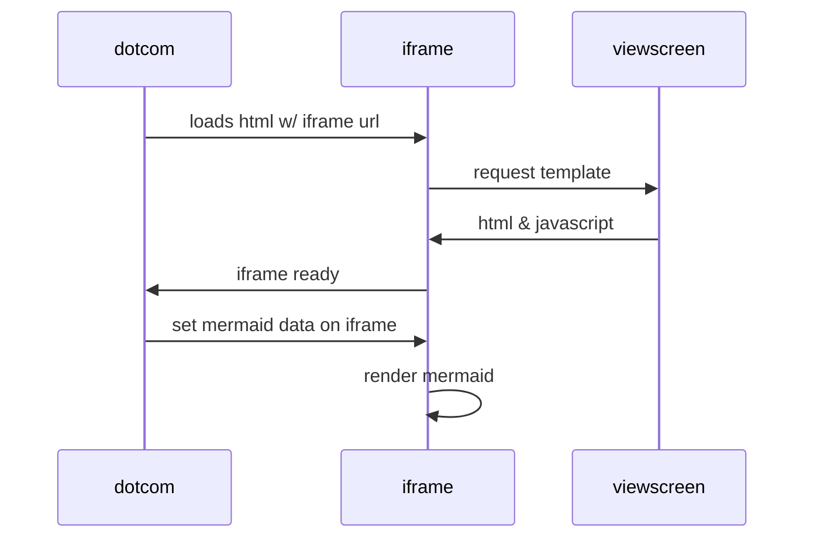
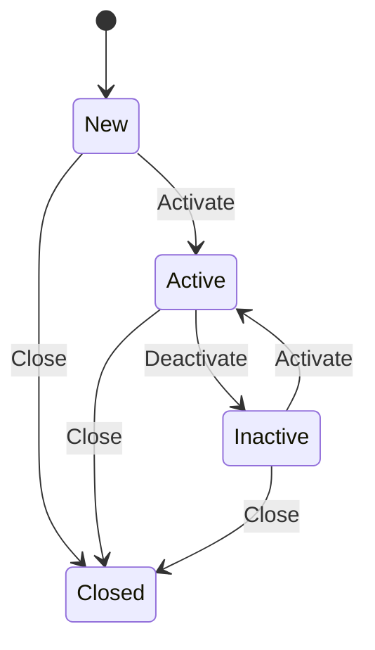

[edit](https://github.com/christrees/wip/edit/main/labnotes/README.md)

# WIP labnotes 
please clear before brain explodes


## wf.2cld.net
- [http://192.168.254.254/advancedsetup_storagedeviceinfo.html](http://192.168.254.254/advancedsetup_storagedeviceinfo.html)
- [tbd]()
- [tbd]()
- [tbd]()
- [tbd]()

## proxmox install doc sync
- [https://netstack.org/docs/lan/compute/proxmox/](https://netstack.org/docs/lan/compute/proxmox/)
- [https://gh.2cld.net/docs/proxmox/](https://gh.2cld.net/docs/proxmox/)
- [https://cf.christrees.com/ns/](https://cf.christrees.com/ns/)
- From [https://tteck.github.io/Proxmox/](https://tteck.github.io/Proxmox/) 
  - github [https://github.com/tteck/Proxmox/blob/main/misc/post-pve-install.sh](https://github.com/tteck/Proxmox/blob/main/misc/post-pve-install.sh)
  - ran from cg node console shell
  ```
  bash -c "$(wget -qLO - https://github.com/tteck/Proxmox/raw/main/misc/post-pve-install.sh)"
  ```
  - github [https://github.com/tteck/Proxmox/blob/main/ct/ubuntu-v5.sh](https://github.com/tteck/Proxmox/blob/main/ct/ubuntu-v5.sh)
  - ran from cg node console shell
  - set static IP 192.168.2.100/24
  ```
  bash -c "$(wget -qLO - https://github.com/tteck/Proxmox/raw/main/ct/ubuntu-v5.sh)"
  ```
  - github [https://github.com/tteck/Proxmox/blob/main/ct/docker-v5.sh](https://github.com/tteck/Proxmox/blob/main/ct/docker-v5.sh)
  - ran from cg node console shell
  - set static IP 192.168.2.103/24
  ```
  bash -c "$(wget -qLO - https://github.com/tteck/Proxmox/raw/main/ct/docker-v5.sh)"
  ```


- [tbd]()
- [tbd]()
- [tbd]()

## zerotier 
- [zerotier on synology](https://docs.zerotier.com/devices/synology/)
- [tbd]()

## QNAP
- QNAP TS-431 [amazon QNAP-TS-431P-US-Cortex-1-7GHzDual](https://www.amazon.com/QNAP-TS-431P-US-Personal-Cortex-1-7GHzDual/dp/B01N2K147Q)

## bring down dockerplex
- [https://cf.christrees.com/ns/](https://cf.christrees.com/ns/)
- dockerplex plex page [http://192.168.6.103:32400/](http://192.168.6.103:32400/)
- proxmox admin page [https://192.168.6.103:8006/](https://192.168.6.103:8006/)
- docker container Summary [https://192.168.6.103:8006/#v1:0:=lxc%2F103:4:::::::](https://192.168.6.103:8006/#v1:0:=lxc%2F103:4:::::::)
- portainer admin page [http://192.168.6.103:9000/#!/auth](http://192.168.6.103:9000/#!/auth)
- volumes in portainer local env [http://192.168.6.103:9000/#!/2/docker/volumes](http://192.168.6.103:9000/#!/2/docker/volumes)
- CT-103 (docker) -> Console to find the volumes mapped into plex via portainer
```
root@docker ~# ls -alu /var/lib/docker/volumes/
total 52
drwx-----x  7 root root  4096 Feb 20 19:44 .
drwx--x--- 13 root root  4096 Feb 20 19:44 ..
-rw-------  1 root root 32768 Jan 29 00:24 metadata.db
drwx-----x  3 root root  4096 Jan 17 23:52 plexConfig
drwx-----x  3 root root  4096 Jan 30 21:11 plexDVR
drwx-----x  3 root root  4096 Jan 16 03:09 plexMovies
drwx-----x  3 root root  4096 Jan 17 23:50 portainer_data
drwx-----x  3 root root  4096 Jan 30 21:10 zfs2tbplexdvr
root@docker ~# ls -alu /var/lib/docker/volumes/plexDVR/
total 12
drwx-----x 3 root root 4096 Feb 20 19:44 .
drwx-----x 7 root root 4096 Feb 20 19:44 ..
drwxr-xr-x 7 1000 1000 4096 Feb  3 00:20 _data
root@docker ~# ls -alu /var/lib/docker/volumes/plexDVR/_data/
total 28
drwxr-xr-x 7 1000 1000 4096 Feb 20 19:44  .
drwx-----x 3 root root 4096 Feb 20 19:44  ..
drwxr-xr-x 2 1000 1000 4096 Feb 20 04:43  .grab
drwxr-xr-x 3 1000 1000 4096 Jan 20 02:03 'Ghosts (2021)'
drwxr-xr-x 3 1000 1000 4096 Jan 16 23:03 'MacGyver (1985)'
drwxr-xr-x 4 1000 1000 4096 Jan 16 22:33 'Mom (2013)'
drwxr-xr-x 3 1000 1000 4096 Jan 17 00:03 'The A-Team (1983)'
root@docker ~#
```
- rsync -rv -e ‘ssh -p 2020’ /var/lib/docker/volumes/plexDVR/_data/ buadmin@192.168.2.105:/volume1/pshare/bs01DVR/
- [tbd]()

## plex storage sort
- setup ds211j to (storageserver ds211j) ssds211j 192.168.6.159 nsadmin What#Time disable admin setup sshauthkey
- map out storage for plex dvr
  - target ds411 for plex storage
  - target ds211j for temp trink dvr ? not sure
  - setup rsync
- attempt all tuners to one plex and attempt recording 8 streams to see if it breaks
- move trinkdvr off cattvwin10
- move ssh target

## rsync setup for plex dvr
- setup buadmin user on bu01ds411 192.168.2.105
- enable ssh on bu01ds411 
- enable rsync on bu01ds411
- ebable user buadmin to use rsync
- setup ssh keys [ssh key config](https://www.digitalocean.com/community/tutorials/how-to-configure-ssh-key-based-authentication-on-a-linux-server)
  - ghadmin@cattvWin10:~$ ssh-keygen
  - ghadmin@cattvWin10:~$ ssh-copy-id buadmin@192.168.2.105
- rsync -rv --chown=mdt:972 -e 'ssh -p 2020' trink@test.christrees.com:/mnt/zpool-01/plex/ /mnt/data/media/video/dvr/
- rsync -rv -e 'ssh -p 2020' "/mnt/d/cattvDVR/Resident Alien (2021)/" buadmin@192.168.2.105:/volume1/pshare/tvNew/
- buadmin@bs01ds411:/volume1/pshare$ mv tvNew "Resident Alien (2021)"
- buadmin@bs01ds411:/volume1/pshare$ chown -R plex Resident\ Alien\ \(2021\)/
- buadmin@bs01ds411:/volume1/pshare$ mkdir tvNew
- buadmin@bs01ds411:/volume1/pshare$ mv Resident\ Alien\ \(2021\)/ tvNew/
- buadmin@bs01ds411:/volume1/pshare/tvNew$ mkdir ghosts
- buadmin@bs01ds411:/volume1/pshare/tvNew$ mkdir sheldon
- buadmin@bs01ds411:/volume1/pshare/tvNew$ mkdir nightcourt
- buadmin@bs01ds411:/volume1/pshare/tvNew$ mkdir qleap
- buadmin@bs01ds411:/volume1/pshare/tvNew$ mkdir shmtodd
- rsync -rv -e 'ssh -p 2020' /mnt/d/cattvDVR/Ghosts\ \(2021\)/ buadmin@192.168.2.105:/volume1/pshare/tvNew/ghosts/
- rsync -rv -e 'ssh -p 2020' /mnt/d/cattvDVR/Young\ Sheldon\ \(2017\)/ buadmin@192.168.2.105:/volume1/pshare/tvNew/sheldon/
- rsync -rv -e 'ssh -p 2020' /mnt/d/cattvDVR/Night\ Court\ \(2023\)/ buadmin@192.168.2.105:/volume1/pshare/tvNew/nightcourt/
- rsync -rv -e 'ssh -p 2020' /mnt/d/cattvDVR/Quantum\ Leap\ \(2022\)/ buadmin@192.168.2.105:/volume1/pshare/tvNew/qleap/
- rsync -rv -e 'ssh -p 2020' /mnt/d/cattvDVR/So\ Help\ Me\ Todd\ \(2022\)/ buadmin@192.168.2.105:/volume1/pshare/tvNew/shmtodd/
```
buadmin@bs01ds411:/volume1/pshare/tvNew$ mv shmtodd/ "So Help Me Todd (2022)"
buadmin@bs01ds411:/volume1/pshare/tvNew$ sudo chown -R plex So\ Help\ Me\ Todd\ \(2022\)/
buadmin@bs01ds411:/volume1/pshare/tvNew$ mv qleap/ "Quantum Leap (2022)"
buadmin@bs01ds411:/volume1/pshare/tvNew$ sudo chown -R plex Quantum\ Leap\ \(2022\)/
buadmin@bs01ds411:/volume1/pshare/tvNew$ mv nightcourt/ "Night Court (2023)"
buadmin@bs01ds411:/volume1/pshare/tvNew$ sudo chown -R plex Night\ Court\ \(2023\)/
buadmin@bs01ds411:/volume1/pshare/tvNew$ mv sheldon/ "Young Sheldon (2017)"
buadmin@bs01ds411:/volume1/pshare/tvNew$ sudo chown -R plex Young\ Sheldon\ \(2017\)/
buadmin@bs01ds411:/volume1/pshare/tvNew$ mv ghosts/ "Ghosts (2021)"
buadmin@bs01ds411:/volume1/pshare/tvNew$ sudo chown -R plex Ghosts\ \(2021\)/
```
- rsync -rv -e 'ssh -p 2020'  /mnt/d/cattvDVR/Hogan* buadmin@192.168.2.105:/volume1/pshare/tvOld/
- rsync -rv -e 'ssh -p 2020'  /mnt/d/cattvDVR/Accord* buadmin@192.168.2.105:/volume1/pshare/tvOld/
- rsync -rv -e 'ssh -p 2020'  /mnt/d/cattvDVR/That* buadmin@192.168.2.105:/volume1/pshare/tvOld/
- rsync -rv -e 'ssh -p 2020'  /mnt/d/cattvDVR/Rick* buadmin@192.168.2.105:/volume1/pshare/tvAnew/
- rsync -rv -e 'ssh -p 2020'  /mnt/d/cattvDVR/Bob* buadmin@192.168.2.105:/volume1/pshare/tvAnew/
- rsync -rv -e 'ssh -p 2020'  /mnt/d/cattvDVR/King* buadmin@192.168.2.105:/volume1/pshare/tvAold/

## ns document single node
- document ns proxmox install backup recovery and rebuild cf
- document ns pfsense install backup recovery and rebuild cf
- document ns truenas install backup recovery and rebuild cf

## home assistant [https://netstack.org/docs/portals/homeassistant/](https://netstack.org/docs/portals/homeassistant/)
- [ha on synology](https://www.home-assistant.io/installation/alternative/#synology-nas)

### cameras
- [https://blinkforhome.com/blink-app](https://blinkforhome.com/blink-app)
- [Using WyzeCam in Home Assistant (with RTSP firmware)](https://www.youtube.com/watch?v=RD6K30ftV24)
- [How to add Zmodo cameras to Zoneminder and monitor with Home Assistant](https://www.youtube.com/watch?v=3L9_in6LciY&t=116s)
= [tbd]()

## plex [https://netstack.org/docs/portals/plex/](https://netstack.org/docs/portals/plex/)
- [definitive_plex_pfsense_config_post](https://www.reddit.com/r/PleX/comments/10ud1q9/definitive_plex_pfsense_config_post/)
- [2_dvr_tuners_hdhr_antenna_iptv_xteve_with_xml_epg](https://www.reddit.com/r/PleX/comments/nqb67e/2_dvr_tuners_hdhr_antenna_iptv_xteve_with_xml_epg/)
- [integrate_youtubetv_or_plutotv_into_plex_as_livetv](https://www.reddit.com/r/PleX/comments/fc3qod/integrate_youtubetv_or_plutotv_into_plex_as_livetv/)
- [4-things-to-know-before-you-sign-up-for-youtube-tv](https://clark.com/technology/tvsatellite-cable/4-things-to-know-before-you-sign-up-for-youtube-tv/)
- Added plexapp to bs01ds411 synology NAS on 192.168.2.105
- [tbd]()

## stoarge [https://netstack.org/docs/lan/storage/freenas/](https://netstack.org/docs/lan/storage/freenas/)
- [zfs-should-belong-to-proxmox-or-truenas](https://forum.proxmox.com/threads/looking-for-advise-zfs-should-belong-to-proxmox-or-truenas.98129/)
- [http://192.168.2.105/](http://192.168.2.105/) bs01ns411
- [synology fan fail fix](https://www.reddit.com/r/synology/comments/bc90fk/synology_cpu_fan_mainboard_failure_simple/)
- [tailscale on synology](https://www.wundertech.net/how-to-set-up-tailscale-on-a-synology-nas/)
- [ceph cluster on proxmox](https://packetpushers.net/proxmox-ceph-full-mesh-hci-cluster-w-dynamic-routing/)
- [tbd]()

## pfsense [https://netstack.org/docs/lan/network/pfsense/](https://netstack.org/docs/lan/network/pfsense/)
- [http://192.168.2.1/diag_arp.php](http://192.168.2.1/diag_arp.php) current arp table for all active devices
- [tbd]()

| iface ip          | mac               | description |
|-------------------|-------------------|---------------------------|
| WAN	192.168.6.174	| 08:71:90:69:20:bc	|	Expires in 98 seconds	ethernet	| 
| WAN	192.168.6.103	| ee:c2:88:aa:db:9d	|	Permanent	ethernet	| 
| WAN	192.168.6.196	| ee:c2:88:aa:db:9d	| 	Permanent	ethernet	| 
| WAN	192.168.6.1	| 48:77:46:f6:bd:96	| 	Expires in 1193 seconds	ethernet	| 
| LAN	192.168.2.3	| 00:15:17:5b:f2:80	| 	Expires in 1095 seconds	ethernet	| 
| LAN	192.168.2.103	| 1a:fe:a1:03:ed:28	| 	Expires in 491 seconds	ethernet	| 
| LAN	192.168.2.105	| 00:11:32:08:c4:24	| bs01ds411	Expires in 1049 seconds	ethernet	| 
| LAN	192.168.2.100	| 00:15:17:5b:f3:09	| cattvWin10	Expires in 1147 seconds	ethernet	| 
| LAN	192.168.2.102	| 00:18:dd:08:0a:d0	| HDHR-1080AD03	Expires in 1106 seconds	ethernet	| 
| LAN	192.168.2.1	| 9e:ac:9e:66:a4:59	| pfSense.home.arpa	Permanent	ethernet	| 
| LAN	192.168.2.2	| 4a:35:41:f6:ba:c7	| truenas	Expires in 161 seconds	ethernet | 

### Charts in markdown mermaid
- [https://github.blog/2022-02-14-include-diagrams-markdown-files-mermaid/](https://github.blog/2022-02-14-include-diagrams-markdown-files-mermaid/)





