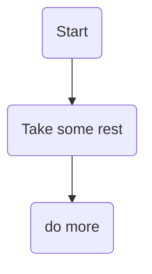
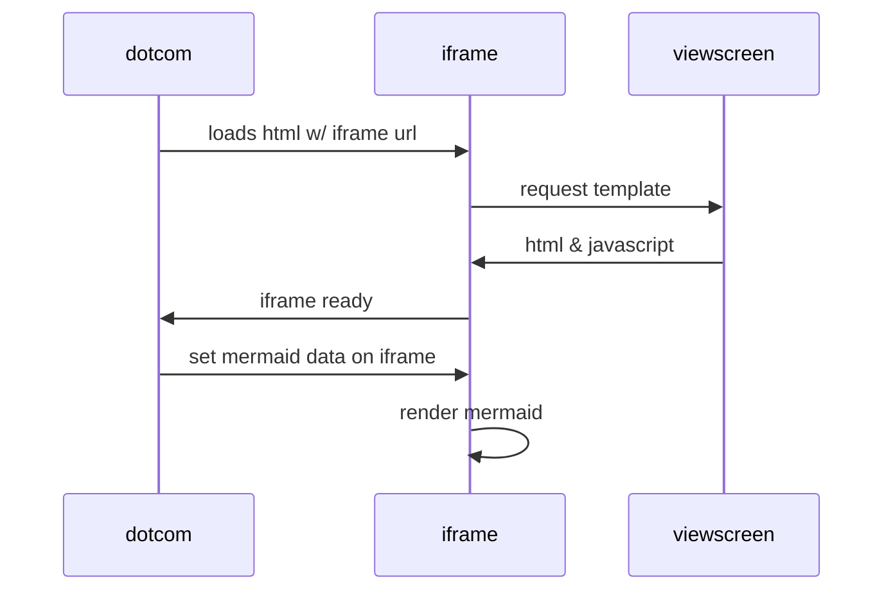
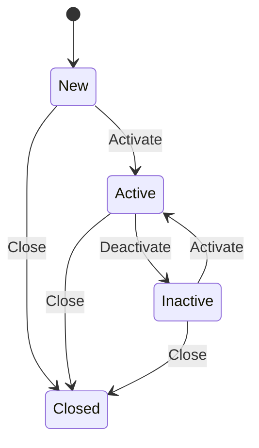

markdown-mermaid
[edit](https://github.com/christrees/wip/edit/main/labnotes/markdown-mermaid.md)

- [mermaid cheatsheet https://jojozhuang.github.io/tutorial/mermaid-cheat-sheet/](https://jojozhuang.github.io/tutorial/mermaid-cheat-sheet/)
---

### Charts in markdown mermaid
- [https://github.blog/2022-02-14-include-diagrams-markdown-files-mermaid/](https://github.blog/2022-02-14-include-diagrams-markdown-files-mermaid/)

