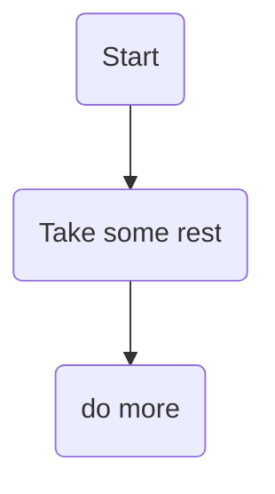
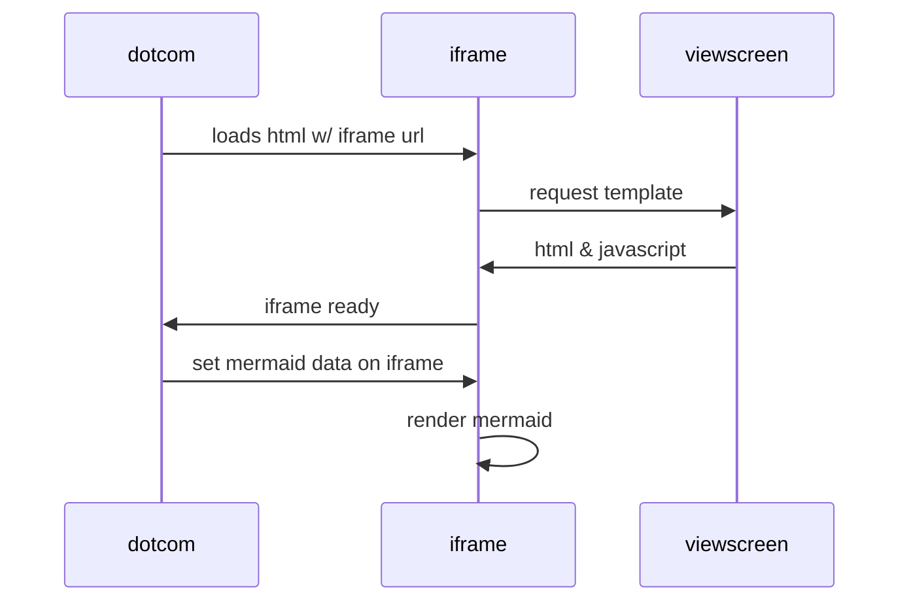
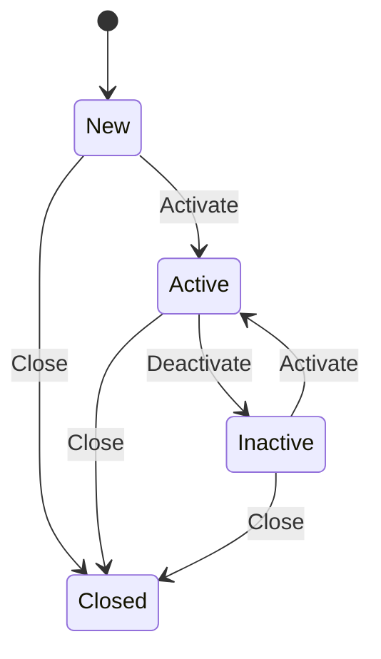

markdown-mermaid
[edit](https://github.com/christrees/wip/edit/main/labnotes/markdown-mermaid.md)

### nested tables

|                |ASCII                          |HTML                         |
|----------------|-------------------------------|-----------------------------|
|Single backticks|`'Isn't this fun?'`            |'Isn't this fun?'            |
|Quotes          |`"Isn't this fun?"`            |<table>  <thead>  <tr>  <th></th>  <th>ASCII</th>  <th>HTML</th>  </tr>  </thead>  <tbody>  <tr>  <td>Single backticks</td>  <td><code>'Isn't this fun?'</code></td>  <td>‘Isn’t this fun?’</td>  </tr>  <tr>  <td>Quotes</td>  <td><code>"Isn't this fun?"</code></td>  <td>“Isn’t this fun?”</td>  </tr>  <tr>  <td>Dashes</td>  <td><code>-- is en-dash, --- is em-dash</code></td>  <td>– is en-dash, — is em-dash</td>  </tr>  </tbody>  </table>      |
|Dashes          |`-- is en-dash, --- is em-dash`|-- is en-dash, --- is em-dash|

```
|                |ASCII                          |HTML                         |
|----------------|-------------------------------|-----------------------------|
|Single backticks|`'Isn't this fun?'`            |'Isn't this fun?'            |
|Quotes          |`"Isn't this fun?"`            |<table>  <thead>  <tr>  <th></th>  <th>ASCII</th>  <th>HTML</th>  </tr>  </thead>  <tbody>  <tr>  <td>Single backticks</td>  <td><code>'Isn't this fun?'</code></td>  <td>‘Isn’t this fun?’</td>  </tr>  <tr>  <td>Quotes</td>  <td><code>"Isn't this fun?"</code></td>  <td>“Isn’t this fun?”</td>  </tr>  <tr>  <td>Dashes</td>  <td><code>-- is en-dash, --- is em-dash</code></td>  <td>– is en-dash, — is em-dash</td>  </tr>  </tbody>  </table>      |
|Dashes          |`-- is en-dash, --- is em-dash`|-- is en-dash, --- is em-dash|
```

---

- [mermaid cheatsheet https://jojozhuang.github.io/tutorial/mermaid-cheat-sheet/](https://jojozhuang.github.io/tutorial/mermaid-cheat-sheet/)
---



### Charts in markdown mermaid
- [https://github.blog/2022-02-14-include-diagrams-markdown-files-mermaid/](https://github.blog/2022-02-14-include-diagrams-markdown-files-mermaid/)





