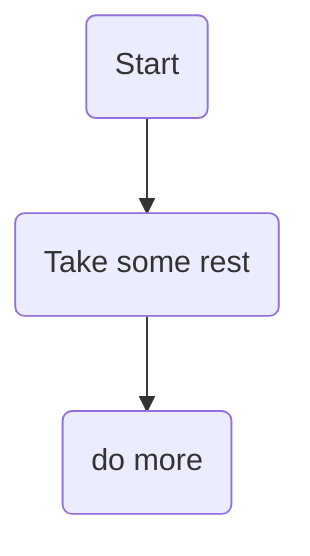
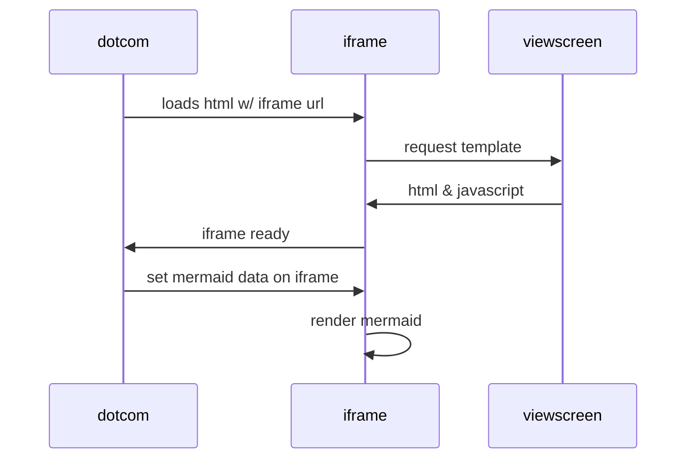
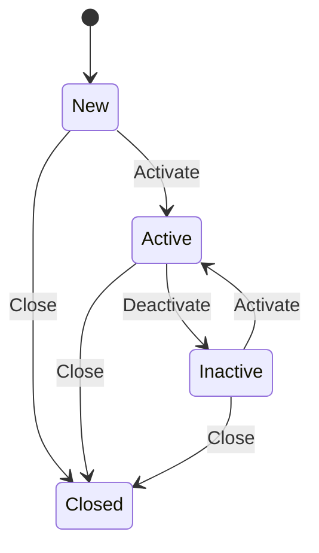

markdown-mermaid
[edit](https://github.com/christrees/wip/edit/main/labnotes/markdown-mermaid.md)

## Reference
- [Mermaid Live Editor Example](https://mermaid-js.github.io/mermaid-live-editor/edit#pako:eNpVkM1qw0AMhF9F6NRC_AI-FBq7zSWlhebm9UF45eyS7A9rmRBsv3vXMYVWJ6H5RgwzYRc0Y4n9Ndw6Q0ngVCsPeV6byiQ7iKOhhaJ4mQ8s4ILn-wz7p0OAwYQYrT8_b_x-haCajivGIMb6y7JJ1cP_6XmGujlSlBDbv8rpFmZ4a-yXye__KyZxdr03PZU9FR0lqCi1uEPHyZHVOfq0GhSKYccKy7xqSheFyi-Zo1HC9913WEoaeYdj1CRcWzoncr9H1lZC-tiqeDSy_ACRQFrz)
- [Mermaid Home Assistant Live Network](https://community.home-assistant.io/t/live-network-diagram-influxdb-grafana-mermaid/100956)
- [Mermaid js converter github](https://github.com/superj80820/mermaid-js-converter/blob/master/example.md) and [Mermaid Converter how-to](https://github.com/superj80820/mermaid-js-converter#how-to-use)
- [Mermaid cli](https://github.com/mermaidjs/mermaid.cli)
- [Mermaid github include markdown files](https://github.blog/2022-02-14-include-diagrams-markdown-files-mermaid/)
- tbd


### nested tables

|                |ASCII                          |HTML                         |
|----------------|-------------------------------|-----------------------------|
|Single backticks|`'Isn't this fun?'`            |'Isn't this fun?'            |
|Quotes          |`"Isn't this fun?"`            |<table>  <thead>  <tr>  <th></th>  <th>ASCII</th>  <th>HTML</th>  </tr>  </thead>  <tbody>  <tr>  <td>Single backticks</td>  <td><code>'Isn't this fun?'</code></td>  <td>‘Isn’t this fun?’</td>  </tr>  <tr>  <td>Quotes</td>  <td><code>"Isn't this fun?"</code></td>  <td>“Isn’t this fun?”</td>  </tr>  <tr>  <td>Dashes</td>  <td><code>-- is en-dash, --- is em-dash</code></td>  <td>– is en-dash, — is em-dash</td>  </tr>  </tbody>  </table>      |
|Dashes          |`-- is en-dash, --- is em-dash`|-- is en-dash, --- is em-dash|

```
|                |ASCII                          |HTML                         |
|----------------|-------------------------------|-----------------------------|
|Single backticks|`'Isn't this fun?'`            |'Isn't this fun?'            |
|Quotes          |`"Isn't this fun?"`            |<table>  <thead>  <tr>  <th></th>  <th>ASCII</th>  <th>HTML</th>  </tr>  </thead>  <tbody>  <tr>  <td>Single backticks</td>  <td><code>'Isn't this fun?'</code></td>  <td>‘Isn’t this fun?’</td>  </tr>  <tr>  <td>Quotes</td>  <td><code>"Isn't this fun?"</code></td>  <td>“Isn’t this fun?”</td>  </tr>  <tr>  <td>Dashes</td>  <td><code>-- is en-dash, --- is em-dash</code></td>  <td>– is en-dash, — is em-dash</td>  </tr>  </tbody>  </table>      |
|Dashes          |`-- is en-dash, --- is em-dash`|-- is en-dash, --- is em-dash|
```

---

- [mermaid cheatsheet https://jojozhuang.github.io/tutorial/mermaid-cheat-sheet/](https://jojozhuang.github.io/tutorial/mermaid-cheat-sheet/)
---



### Charts in markdown mermaid
- [https://github.blog/2022-02-14-include-diagrams-markdown-files-mermaid/](https://github.blog/2022-02-14-include-diagrams-markdown-files-mermaid/)





