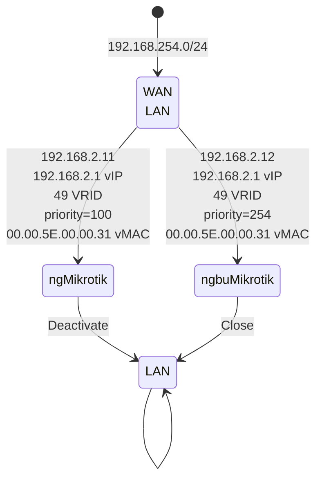

- Live Edit [https://mermaid.live/](https://mermaid.live/)

```mermaid
stateDiagram
    [*] --> WAN<br>LAN : 192.168.254.0/24
    WAN<br>LAN --> ngMikrotik : 192.168.2.11 <br> 192.168.2.1 vIP <br> 49 VRID <br> priority=100 <br> 00.00.5E.00.00.31 vMAC
    WAN<br>LAN --> ngbuMikrotik : 192.168.2.12 <br> 192.168.2.1 vIP <br> 49 VRID <br> priority=254 <br> 00.00.5E.00.00.31 vMAC
    ngMikrotik --> LAN : Deactivate
    ngbuMikrotik --> LAN : Close
    LAN --> LAN
  
```
