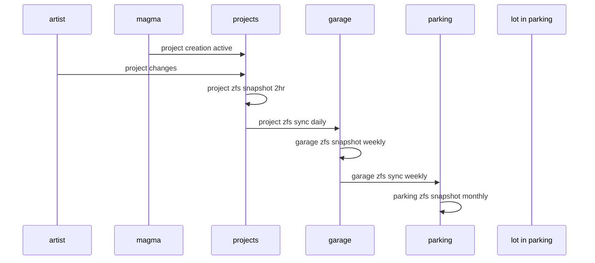
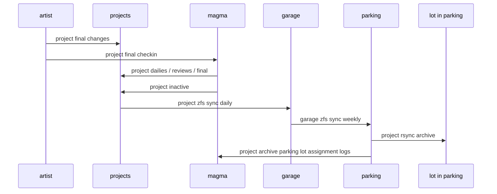
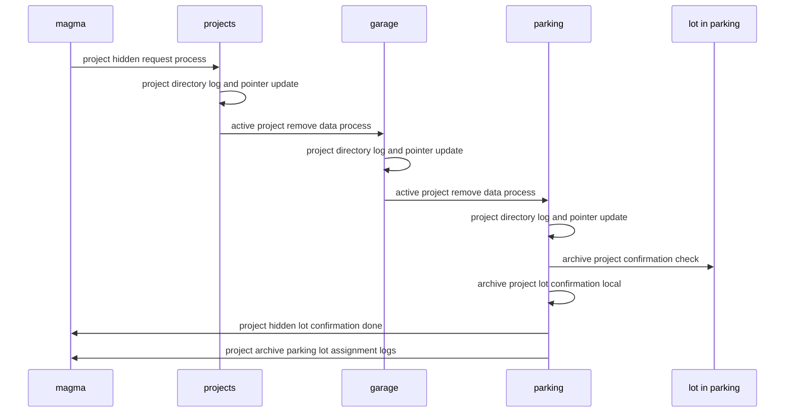
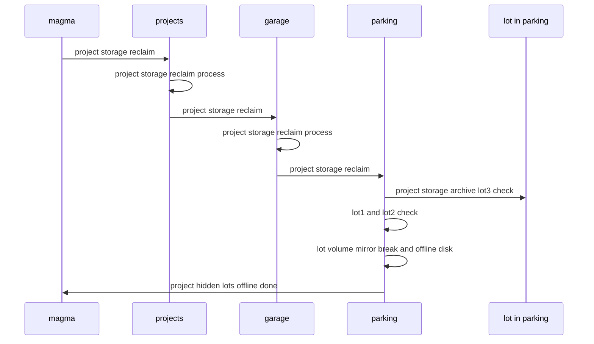

[edit](https://github.com/christrees/wip/edit/main/labnotes/storage-backup-archive.md)
# Grasshorse project data lifecycle
based on [https://github.com/2cld/netstack/blob/master/docs/ops/backup/backup-diagram.md](https://github.com/2cld/netstack/blob/master/docs/ops/backup/backup-diagram.md)

- project active or creation of new project

- project inactive and/or project release

- project hidden

- project archive resource reclaim

