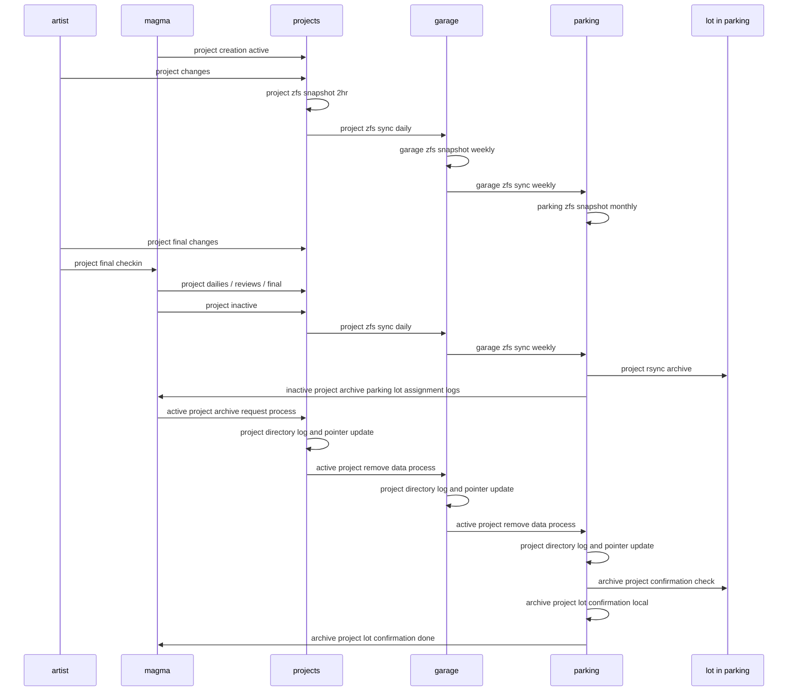

# Grasshorse project data lifecycle

```mermaid
sequenceDiagram
    participant artist
    participant magma
    participant projects
    participant garage
    participant parking
    participant lot in parking
    magma->>projects: project creation active
    artist->>projects: project changes
    projects->>projects: project zfs snapshot 2hr
    projects->>garage: project zfs sync daily
    garage->>garage: garage zfs snapshot weekly
    garage->>parking: garage zfs sync weekly
    parking->>parking: parking zfs snapshot monthly
    artist->>projects: project final changes
    artist->>magma: project final checkin
    magma->>projects: project dailies / reviews / final
    magma->>projects: project inactive
    projects->>garage: project zfs sync daily
    garage->>parking: garage zfs sync weekly
    parking->>lot in parking: project rsync archive
    parking->>magma: inactive project archive parking lot assignment logs
    magma->>projects: active project archive request process
    projects->>projects: project directory log and pointer update
    projects->>garage: active project remove data process
    garage->>garage: project directory log and pointer update
    garage->>parking: active project remove data process
    parking->>parking: project directory log and pointer update
    parking->>lot in parking: archive project confirmation check
    parking->>parking: archive project lot confirmation local
    parking->>magma: archive project lot confirmation done
   
```
