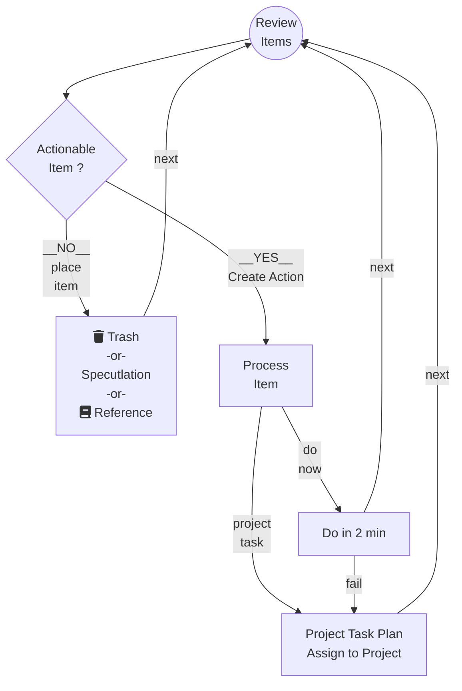

[edit]()

# WIP Workflow
1. Review Items
2. Actionalble
3. Process
4. Project

```mermaid
flowchart TD
    B((Review<br/>Items))
    B --> C{Actionable<br/>Item ?}
    C -->|__NO__<br/>place<br/>item| F[fa:fa-trash Trash<br/>-or-<br/>Specutlation<br/>-or-<br/>fa:fa-book Reference]
    C -->|__YES__<br/>Create Action| D[Process<br/>Item]
    D -->|project<br/>task| G[Project Task Plan<br/>Assign to Project]
    D -->|do<br/>now| T[Do in 2 min]
    G -->|next| B
    F -->|next| B
    T -->|fail| G
    T -->|next| B
```
