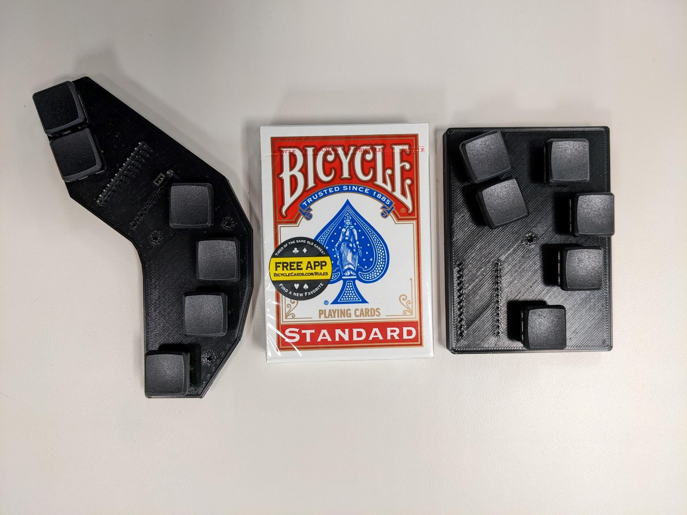

[edit](https://github.com/christrees/wip/edit/main/tdchord/README.md)

# Trink Dan Chord keyboard project

- Keyboard firmware development and test
  - [https://zmk.dev/](https://zmk.dev/)
  - need link to firmware and github generation
- Keyboard Prototype
  - [nice!nano](https://nicekeyboards.com/nice-nano)
  - need link to keys, pcb, case
- Keyboard key layout, pcb and case generation
  - [https://ergogen.cache.works/](https://ergogen.cache.works/)
  - use node to generate file
    - node src/cli.js .
    - js.cad file
    - case.jscad -of stla -o case.stl 
    - to create -> stl file
    - PRUSA mini printer slicer
    - config.yaml (the ergogen file)
  - [https://www.kicad.org/](https://www.kicad.org/)
  - [freecad]()
  - need info on 3D conversion for case pring

---

## Reference
- Microwriter Docs
  - [Microsoft Microwriter - buxton collection](https://www.microsoft.com/buxtoncollection/detail.aspx?id=5)
- Erogen keyboard layout
  - [https://docs.ergogen.xyz/config-overview/](https://docs.ergogen.xyz/config-overview/)
  - [https://ergogen.cache.works/](https://ergogen.cache.works/)
  - [Design Your Own Keyboard! youtube keyboard build](https://www.youtube.com/watch?v=M_VuXVErD6E)
- zmk keyboard firmware
  - [https://zmk.dev/docs/development/setup](https://zmk.dev/docs/development/setup)
  - [https://github.com/zmkfirmware/zmk](https://github.com/zmkfirmware/zmk)
  - [https://zmk.dev/](https://zmk.dev/)
- [https://github.com/nickcoutsos/keymap-editor](https://github.com/nickcoutsos/keymap-editor)
- [https://www.kicad.org/](https://www.kicad.org/)
- [game controller patent](https://www.patentlyapple.com/2020/12/microsoft-has-won-8-design-patents-covering-the-xbox-series-s-console-and-game-controllers-that-cover-those-for-vr-gaming.html)

# Pictures [click here for all pictures](./tdchord-pictures)

- 
- 
- 

