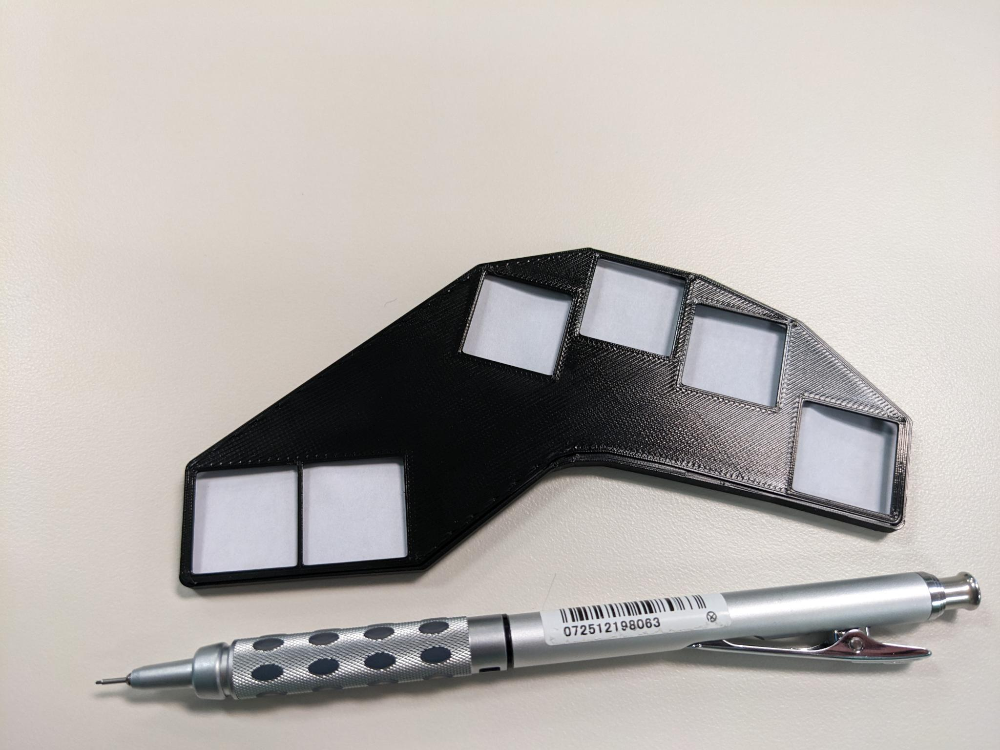
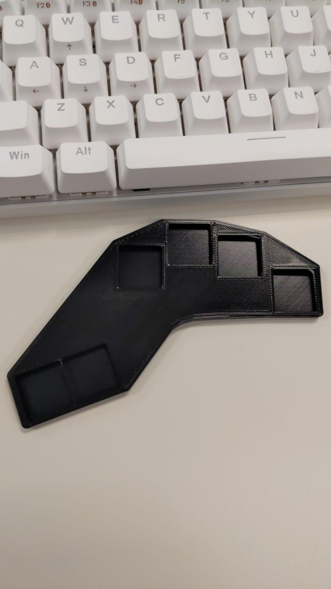
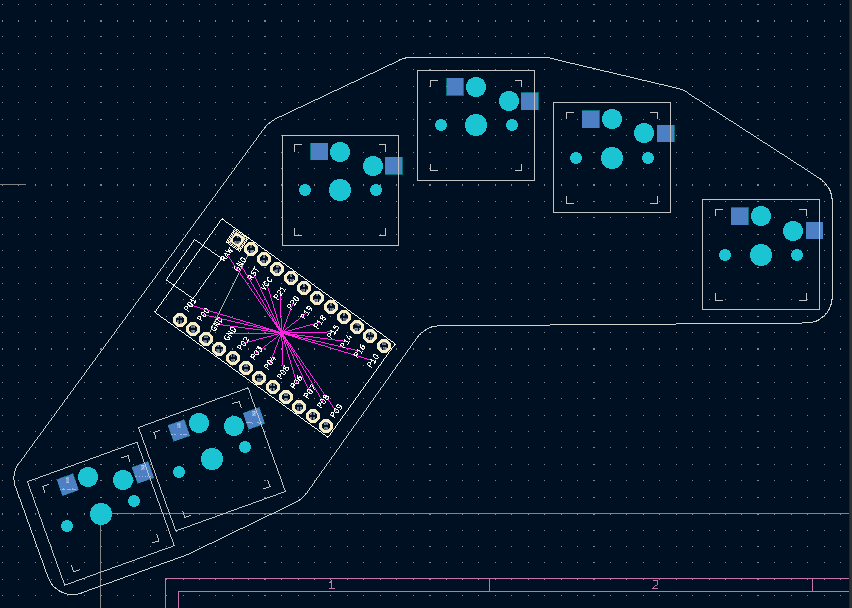
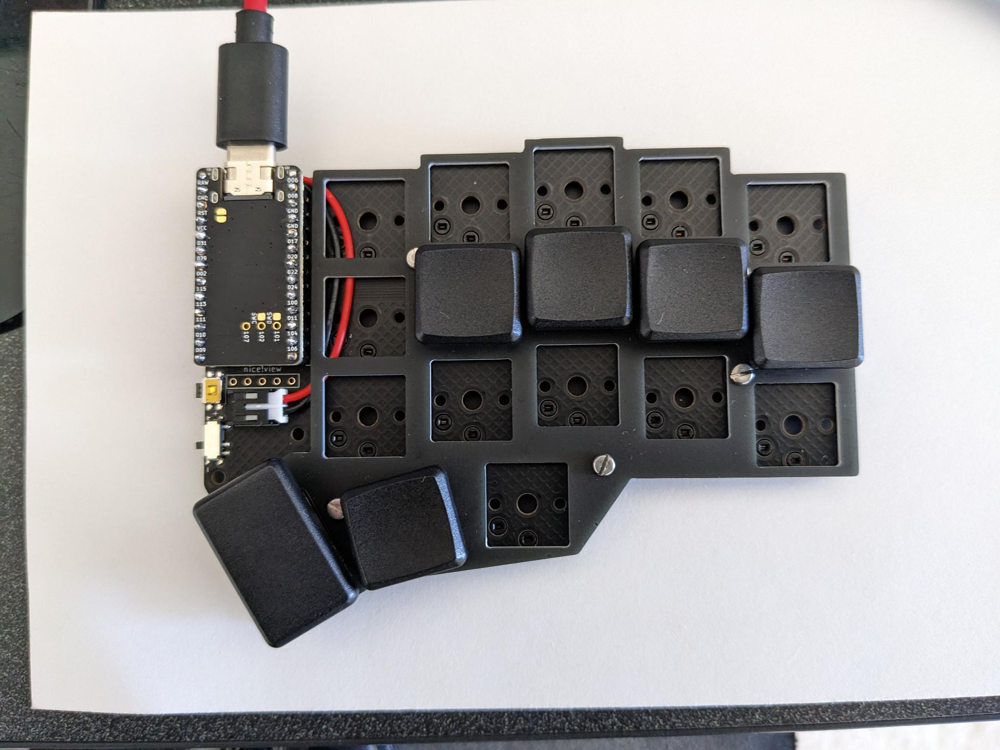
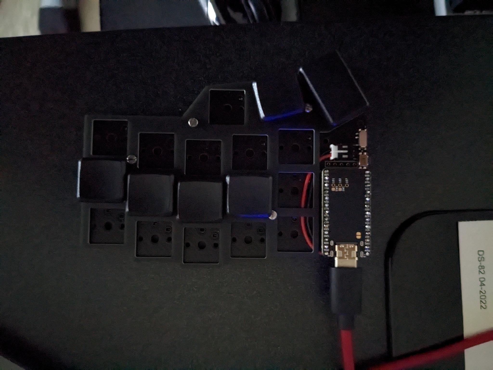

# Trink Dan Chord keyboard project

- Keyboard firmware development and test
  - [https://zmk.dev/](https://zmk.dev/)
  - need link to github generation
- Keyboard key layout, pcb and case generation
  - [https://ergogen.cache.works/](https://ergogen.cache.works/)

---

## Reference
- Microwriter Docs
  - [Microsoft Microwriter - buxton collection](https://www.microsoft.com/buxtoncollection/detail.aspx?id=5)
- Erogen keyboard layout
  - [https://docs.ergogen.xyz/config-overview/](https://docs.ergogen.xyz/config-overview/)
  - [https://ergogen.cache.works/](https://ergogen.cache.works/)
  - [Design Your Own Keyboard! youtube keyboard build](https://www.youtube.com/watch?v=M_VuXVErD6E)
- zmk keyboard firmware
  - [https://zmk.dev/docs/development/setup](https://zmk.dev/docs/development/setup)
  - [https://github.com/zmkfirmware/zmk](https://github.com/zmkfirmware/zmk)
  - [https://zmk.dev/](https://zmk.dev/)
- [https://github.com/nickcoutsos/keymap-editor](https://github.com/nickcoutsos/keymap-editor)

# Pictures
- 
- 
- 
- 
- 
- 
- 
- 
- 
- 
- 
- 
- 
- 
